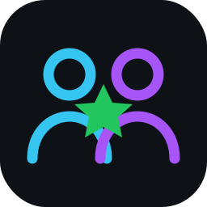

<div align="center">
  
  <h1>PartnerShip</h1>
  <p><strong>A Codex-style desktop environment where you and your AI agents work side by side — and ship results straight to your folders.</strong></p>
  <p>
    
    
    
    
    
  </p>
</div>

---

PartnerShip joins a **markdown workspace**, **up to two live agent workspaces**, and **real terminals** into one dark, Apple-smooth desktop app. Agents see what you're doing, can be summoned to help, and — when you allow it — take over to edit files and run commands in real time. A sidebar command center manages conversations, automations, and a Kanban idea board. It runs on **Windows and Linux/WSL**, and talks to Claude using your **Pro/Max subscription** (no API key) via the bundled MCP integration.

> Personal, multi-agent, multi-terminal — like Codex, minus the browser, plus a live markdown editor agents can work in alongside you.

## Table of contents
- [Features](#features)
- [Architecture](#architecture)
- [Prerequisites](#prerequisites)
- [Quick start](#quick-start)
- [Connecting Claude (your subscription)](#connecting-claude-your-subscription)
- [Integrations via MCP](#integrations-via-mcp)
- [Configuration reference](#configuration-reference)
- [Scripts](#scripts)
- [Keyboard shortcuts & slash commands](#keyboard-shortcuts--slash-commands)
- [Building installers](#building-installers)
- [Project structure](#project-structure)
- [Security](#security)
- [Troubleshooting](#troubleshooting)
- [Roadmap](#roadmap)
- [Contributing](#contributing)
- [License](#license)

## Features

- **Markdown workspace** — Monaco editor in markdown mode, a tree of your workspace, create/rename/delete, **auto-save to disk** with a Saved indicator. Only `.md` is editable in v1; other files are listed read-only.
- **Up to 2 agent workspaces** — summon, review, or hand over. Each pane has its own session, agent (Claude / Hermes / Mock), slash commands, and a take-over toggle.
- **Real terminals** — xterm.js backed by real PTYs. Windows detects **WSL distros**, PowerShell, and cmd; Linux uses bash/zsh. Multiple tabs.
- **Summon + take over** — `Ctrl+Shift+A` asks the agent to help with the active file + selection + terminal tail. **Take over** grants `edit_file` / `run_command`; **Stop** revokes instantly.
- **Claude on your subscription** — drives the Claude Code CLI with your Pro/Max OAuth, not the metered API.
- **MCP integration** — a bundled MCP server exposes the workspace (files, Kanban, sessions, automations) to the in-app agent and to any external MCP client.
- **Sidebar command center**
  - **Conversations** — sessions with status, search, filter, rename/fork/archive. Capped at **13**; at the cap, *Commit conversations to log* glows green and collapses history into one markdown log.
  - **Automations** — cron-style jobs (presets + custom cron), thread or standalone, run-now, on/off, run history.
  - **Kanban** — Backlog / In progress / Blocked / Done, drag-and-drop, *Create session from card*, attach markdown.
- **Sandboxed & audited** — every file op and agent tool call is validated to stay inside the workspace root; agent edits, commands, and automation runs are appended to `.partnership/logs/audit.log`.
- **Restore on launch** — reopens your last workspace, files, sessions, and layout.

## Architecture

| Layer | Tech |
|---|---|
| Desktop shell | Electron + electron-vite |
| Language | TypeScript (strict) end to end |
| UI | React 18, React Router, Tailwind, Radix UI |
| State / data | Zustand + TanStack Query |
| Panes | react-resizable-panels |
| Editor | Monaco (markdown) |
| Terminal | xterm.js + node-pty (optional native) |
| Scheduler / history | node-cron + JSON |
| Agent (Claude) | Claude Code CLI (subscription) + MCP |
| Integrations | `@modelcontextprotocol/sdk` (bundled server) |
| Packaging | electron-builder (Win + Linux) |

Three-process model with a shared contract:

```
MAIN (Node)  ── fs sandbox · pty mgr · agent providers · scheduler · ipc handlers
   │  contextBridge (preload, typed window.partnership)
   ▼
RENDERER (React) ── sidebar | editor | agent panes | terminals (resizable grid)

common/  ── shared types: data model · tool schemas · agent events · ipc channels
mcp/     ── standalone MCP server exposing the workspace to any MCP client
```

## Prerequisites

- **Node.js 18+** (tested on 24) and npm.
- **Claude Code CLI** (for the Claude agent on your subscription): `npm i -g @anthropic-ai/claude-code`.
- **Optional — a C++ toolchain** so `node-pty` can build (real terminals). Without it the app still runs; terminals show a hint until built.
  - **Windows**: Visual Studio Build Tools with the *Desktop development with C++* workload, plus Python 3.
  - **Linux/WSL**: `sudo apt-get install -y build-essential python3`.

> **Your files live in WSL? Run the app inside WSL** (via WSLg on Windows 11). You get native-fast access to `/home/...`, real bash terminals, and an easier `node-pty` build (gcc, not Visual Studio). The Windows build also works and auto-detects your WSL distro for terminals, but file IO over `\\wsl.localhost` is slower.

## Quick start

```bash
git clone https://github.com/CreativLogic/PartnerShip.git
cd PartnerShip

npm run setup     # installs app + MCP deps, builds the bundled MCP server
npm run rebuild   # builds node-pty against Electron for real terminals (needs C++ toolchain)
npm run dev       # launches the app with HMR
```

`npm run setup` is equivalent to `npm install && npm run mcp:install && npm run mcp:build`. If you don't need terminals yet, you can skip `npm run rebuild`.

<details>
<summary><strong>Windows + WSL</strong></summary>

Run from a Windows shell (PowerShell). The terminal picker auto-detects installed WSL distros plus PowerShell and cmd. To open WSL files, point the workspace picker at `\\wsl.localhost\<distro>\home\<you>\...` (slower IO — prefer running in WSL).
</details>

<details>
<summary><strong>Pure Linux / inside WSL (recommended for WSL users)</strong></summary>

```bash
sudo apt-get update && sudo apt-get install -y build-essential python3
npm run setup
npm run rebuild
npm run dev        # opens via WSLg on Windows 11
```
Terminals use bash/zsh and the local filesystem directly.
</details>

## Connecting Claude (your subscription)

PartnerShip uses your **Claude Pro/Max subscription** by driving the Claude Code CLI headlessly — it is **not** the metered Anthropic API and needs no API key.

1. Install and sign in once:
   ```bash
   npm i -g @anthropic-ai/claude-code
   claude setup-token         # subscription OAuth -> long-lived token
   ```
2. In an agent pane, pick **claude** as the agent. The pill reads `subscription` when the CLI is detected (`sign in` if not).

Under the hood, the app runs `claude -p … --output-format stream-json` with `cwd = workspace` (so Claude's own Read/Edit/Bash tools touch your files) and loads the PartnerShip MCP for app actions. In subscription mode the app strips `ANTHROPIC_API_KEY` from the child process so you're never billed against API credits by accident.

> Prefer the metered API instead? Set `claude.mode: "apiKey"` and `claude.apiKey` in the config (below).

## Integrations via MCP

The repo ships a standalone **MCP server** (`mcp/`) that exposes the current workspace — markdown files, the Kanban board, agent sessions, and automations — to any MCP client. It's auto-loaded into the in-app Claude, and you can point Claude Desktop or an external Claude Code session at it too.

Add more MCP servers (GitHub, Slack, Postgres, …) under `claude.extraMcpServers` to extend what the in-app agent can reach. Full tool list and external-client setup: [`mcp/README.md`](mcp/README.md).

```bash
npm run mcp:build                                   # bundles mcp/dist/index.js (self-contained)
PARTNERSHIP_WORKSPACE=/path/to/ws npm --prefix mcp run inspect   # poke it with MCP Inspector
```

## Configuration reference

Global config lives at `~/.partnership/config.json` (`%USERPROFILE%\.partnership\config.json` on Windows). Per-workspace state lives under `<workspace>/.partnership/` (`sessions.json`, `automations.json`, `kanban.json`, `logs/audit.log`).

```jsonc
{
  "theme": "dark",
  "lastWorkspace": "/home/you/notes",
  "recentWorkspaces": ["/home/you/notes"],

  "claude": {
    "mode": "subscription",                 // "subscription" (default) | "apiKey"
    "oauthToken": "",                        // optional; from `claude setup-token`. Else a logged-in session is reused
    "apiKey": "",                            // only used when mode === "apiKey"
    "permissionMode": "default",            // "default" | "acceptEdits" | "plan"  (take-over forces "acceptEdits")
    "extraMcpServers": {                     // extra integrations for the in-app agent
      "github": { "command": "npx", "args": ["-y", "@modelcontextprotocol/server-github"], "env": { "GITHUB_TOKEN": "..." } }
    }
  },

  "agentEndpoints": {                        // for non-Claude HTTP agents (e.g. Hermes)
    "hermes": "http://localhost:8788"
  }
}
```

Hermes / custom agents use an HTTP bridge: a server that accepts `POST /agent/infer` and streams `AgentEvent` objects. See `src/common/events.ts` and `src/common/tools.ts`.

## Scripts

| Script | What it does |
|---|---|
| `npm run setup` | Install app + MCP deps and build the MCP server |
| `npm run dev` | Start Electron + React with HMR |
| `npm run rebuild` | Build `node-pty` against Electron (real terminals) |
| `npm run typecheck` | Strict type-check main + preload + renderer |
| `npm run build` | Type-check + production bundle (main/preload/renderer) |
| `npm run lint` / `npm run format` | ESLint / Prettier |
| `npm run mcp:build` | Bundle the MCP server to a single self-contained file |
| `npm run package:win` | Build a Windows NSIS installer |
| `npm run package:linux` | Build Linux AppImage + deb |

## Keyboard shortcuts & slash commands

| Shortcut | Action |
|---|---|
| `Ctrl+Shift+A` | Ask agent to help here |
| `Ctrl+B` | Toggle sidebar |
| `Ctrl+.` | Focus mode |
| `Enter` / `Shift+Enter` | Send / newline in agent input |

Agent-pane slash commands: `/clear` · `/takeover` · `/stop` · `/model claude|hermes|mock` · `/rename <title>`

## Building installers

```bash
npm run package:win     # NSIS installer  -> release/
npm run package:linux   # AppImage + deb  -> release/
```
The bundled MCP server is included in the package as `resources/mcp/index.js`; the app resolves it automatically at runtime. (Run packaging on the target OS — electron-builder does not cross-compile native modules.)

## Project structure

```
PartnerShip/
├ electron.vite.config.ts · tsconfig*.json · tailwind.config.ts · electron-builder.yml
├ resources/logo.svg
├ mcp/                         # standalone MCP server (its own package)
│  └ src/{index,workspace}.ts
└ src/
   ├ common/   types.ts tools.ts events.ts ipc.ts        # the shared contract
   ├ main/     index.ts  fs/workspace.ts  pty/manager.ts
   │           agents/{provider,mock,http,claudecode}.ts
   │           automations/{scheduler,history}.ts  store/appConfig.ts  ipc/handlers.ts
   ├ preload/  index.ts  index.d.ts                        # typed window.partnership
   └ renderer/ src/{App,main}.tsx  store/app.ts
               components/{layout,sidebar,editor,terminal,agent}/
```

## Security

PartnerShip reads and writes only inside the chosen workspace root and its `.partnership` folder. Every file operation and agent tool call is validated against that boundary before touching disk, and the MCP server enforces the same sandbox. All agent/automation actions are appended to `.partnership/logs/audit.log`. In subscription mode the app removes `ANTHROPIC_API_KEY` from the Claude child process.

## Troubleshooting

- **`npm install` fails with `gyp ERR! find VS` (Windows)** — that's `node-pty` needing the C++ toolchain. The app still installs/runs (node-pty is optional); install Build Tools + Python 3 and run `npm run rebuild` to enable terminals, or run the app in WSL.
- **Terminal shows "node-pty not built"** — run `npm run rebuild` (after installing the toolchain).
- **Agent pill says "sign in"** — the `claude` CLI isn't on `PATH`. Install `@anthropic-ai/claude-code`, run `claude setup-token`, restart the app.
- **Claude runs but seems to use API credits** — set `claude.mode: "subscription"` (the default) and ensure no `apiKey` is set; the app strips `ANTHROPIC_API_KEY` in that mode.
- **WSL files are slow** — run the app inside WSL (WSLg) instead of the Windows host.

## Roadmap

- Restore open files + exact layout on launch (currently restores workspace/sessions).
- Diff-mode edits with per-edit accept/reject.
- Code-split Monaco (renderer bundle is ~900 KB).
- App icons for installers.
- First-class "Sign in with Claude" button (runs `claude setup-token` in-app).

## Contributing

Issues and PRs welcome. Please run `npm run typecheck` and `npm run build` before opening a PR. By contributing you agree your contributions are licensed under AGPL-3.0.

## License

**GNU Affero General Public License v3.0 (AGPL-3.0-or-later)** — see [LICENSE](LICENSE).

Copyright (C) 2026 CreativLogic.

PartnerShip is free software: you can redistribute it and/or modify it under the terms of the AGPL. This is **strong copyleft** — anyone who distributes the software **or runs a modified version to provide a network service** must make their **complete corresponding source, including all changes, publicly available** under the same license, and must preserve copyright notices. The software comes with **no warranty**.
